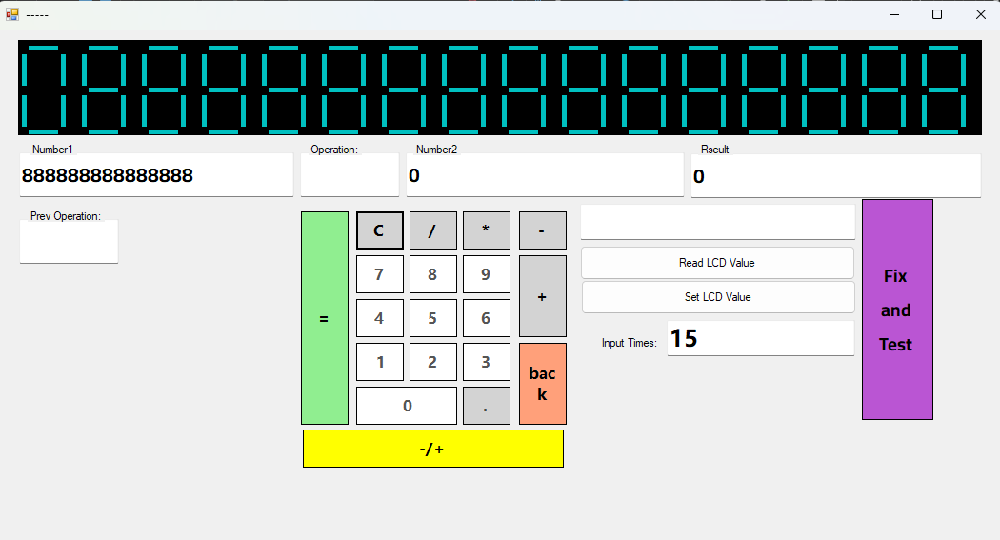

> **Language Notice**: 
> [View in Arabic (العربية)](README_AR.md) | 
# 15-Digit Calculator with 7-Segment Display

 

## Overview
This Windows Forms application implements a 15-digit calculator with a realistic 7-segment display simulation. The calculator supports basic arithmetic operations (addition, subtraction, multiplication, division), decimal values, and includes advanced features like positive/negative toggling and multi-operation chaining.

## Features
- 🧮 **15-digit precision display** with 7-segment LED simulation
- ⚡ **Basic operations**: Addition, Subtraction, Multiplication, Division
- 🔢 **Decimal support** with intelligent dot handling
- 🔄 **Operation chaining** for complex calculations
- ➕/➖ **Sign toggle** for positive/negative values
- 🔙 **Backspace functionality** for error correction
- 🧹 **Clear button** to reset calculations
- 📊 **Visual tracking** of current operation and previous values

## Code Structure
### Key Components:
1. **Main Form (`frm15DigitScreen`)**:
   - Manages calculator state and UI interactions
   - Handles digit input and operations
   - Tracks calculation history

2. **7-Segment Display Control (`ctrlLCDScreen`)**:
   - Custom control that simulates a 15-digit LED display
   - Handles value formatting and digit rendering

3. **Calculation Logic**:
   - State machine for operation management
   - Double precision arithmetic
   - Input validation and error handling

### Important Methods:
- `DoOperations()` - Executes arithmetic operations based on current state
- `_SetOperation()` - Manages operation transitions
- `_GetInput()` - Processes digit and special character input
- `DoCalculation()` - Performs chained operations
- `BackSpace()` - Handles digit removal

## Getting Started
### Prerequisites
- .NET Framework 4.7.2 or later
- Visual Studio 2019+ (recommended)

### Installation
1. Clone the repository:
   ```bash
   git clone https://github.com/MohmdAliMohmd/15-digit-calculator.git
   ```
2. Open the solution in Visual Studio
3. Build the solution (Ctrl+Shift+B)
4. Run the application (F5)

## Usage
1. Enter numbers using the digit buttons
2. Use `.` for decimal values
3. Select an operation (+, -, ×, ÷)
4. Continue calculations or press `=` for results
5. Use `C` to clear the current calculation
6. Toggle sign with `+/-` button

## License
This project is licensed under the MIT License - see the [LICENSE.md](LICENSE.md) file for details.

## Contributing
Contributions are welcome! Please follow these steps:
1. Fork the project
2. Create your feature branch (`git checkout -b feature/AmazingFeature`)
3. Commit your changes (`git commit -m 'Add some amazing feature'`)
4. Push to the branch (`git push origin feature/AmazingFeature`)
5. Open a pull request

---

**Note**: This project includes a custom 7-segment display control that simulates physical calculator displays. The implementation handles digit limitations (15 digits max) and decimal point constraints intelligently.
